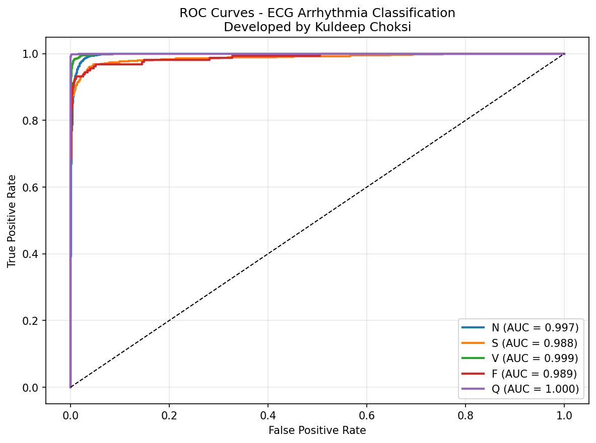
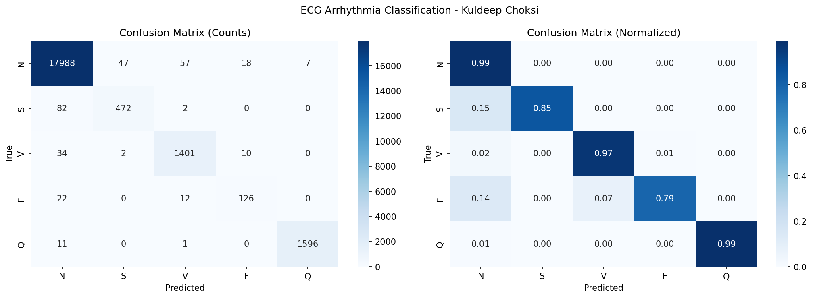
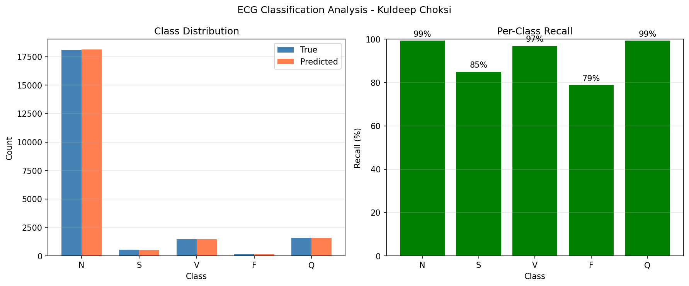
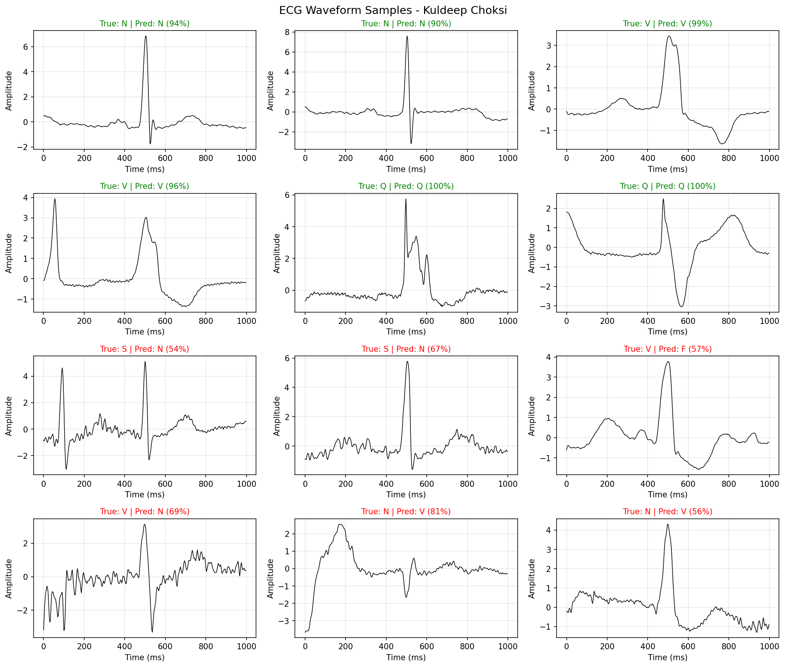

# ECG Arrhythmia Classification

**Developed by Kuldeep Choksi**

A deep learning system for automated detection and classification of cardiac arrhythmias from ECG signals, achieving **98.61% accuracy** on the MIT-BIH Arrhythmia Database.

[](https://www.python.org/downloads/)
[](https://pytorch.org/)
[](https://opensource.org/licenses/MIT)

## Project Overview

This project classifies heartbeats into 5 categories following the AAMI EC57 standard:
- **Normal (N)**: Normal beats
- **Supraventricular (S)**: Supraventricular ectopic beats
- **Ventricular (V)**: Ventricular ectopic beats
- **Fusion (F)**: Fusion of ventricular and normal beats
- **Unknown (Q)**: Paced or unclassifiable beats

### Key Challenge
The dataset exhibits severe class imbalance:
- Normal beats: 82.8% of data
- Rare arrhythmias (S, F): <3% of data
- **Medical Risk**: Missing rare arrhythmias can be life-threatening

## Final Results

| Metric | Value |
|--------|-------|
| **Accuracy** | **98.61%** |
| **F1-Macro** | **0.9250** |
| **F1-Weighted** | **0.9860** |

### Per-Class Performance

| Class | Precision | Recall | F1-Score | Support |
|-------|-----------|--------|----------|---------|
| Normal (N) | 0.99 | 0.99 | 0.99 | 18,117 |
| Supraventricular (S) | 0.91 | 0.85 | 0.88 | 556 |
| Ventricular (V) | 0.95 | 0.97 | 0.96 | 1,447 |
| Fusion (F) | 0.82 | 0.79 | 0.80 | 160 |
| Unknown (Q) | 1.00 | 0.99 | 0.99 | 1,608 |

**All classes achieve ROC AUC ≥ 0.988** - near-perfect discrimination!

## Visualizations

### ROC Curves


*All classes achieve exceptional AUC scores (≥0.988), demonstrating excellent class discrimination.*

### Confusion Matrix


*Strong diagonal with minimal misclassifications across all classes.*

### Per-Class Recall


*All classes maintain >79% recall - critical for medical applications.*

### ECG Waveform Samples


*Sample predictions showing correct (green) and incorrect (red) classifications.*

## The Journey: Iterative Improvements

This project demonstrates systematic problem-solving through three major iterations:

### V1: Initial Approach (88% Accuracy)
**Problem**: Random data splitting caused catastrophic rare class performance
- Used record-based random split
- Validation set had 0 Fusion beats, 0 Unknown beats
- Result: **Fusion recall: 0%**, **Supraventricular recall: 1%**

```
V1 Results:
- Accuracy: 88.01%
- F1-Macro: 0.50
- Supraventricular: 1% recall, 4% precision
- Fusion: 0% recall, 0% precision
```

### V2: Advanced Techniques (Mixed Results)
**Attempted**: Focal Loss + Oversampling
- Focal Loss (γ=2.0) to focus on hard examples
- Oversampling rare classes
- **Issue**: Still used improper data splitting → limited improvement

### V3: The Breakthrough - Stratified Splitting (94% Accuracy)
**Key Insight**: The problem wasn't the model or loss function - it was **data splitting**!

**Solution**: Stratified beat-level splitting ensuring proportional class representation

```python
# Before: Record-based split (imbalanced val/test sets)
train_records = [100, 101, 102, ...]  # 35 records
val_records = [103, 104, 105, 106]    # 4 records (missing rare classes!)
test_records = [107, 108, ...]        # 9 records

# After: Stratified beat-level split
train_test_split(all_beats, stratify=all_labels)
# Every split has: 82.8% N, 2.5% S, 6.6% V, 0.7% F, 7.3% Q
```

**Impact**:
```
V3 Results:
- Accuracy: 94.13% (+6.12%)
- F1-Macro: 0.78 (+0.28)
- Supraventricular: 86% recall (+85%), 52% precision
- Fusion: 88% recall (+88%), 27% precision
```

### V3 Final: Combining All Techniques (98.6% Accuracy)
**Approach**: Stratified Splitting + Focal Loss + Oversampling

Once proper data splitting was in place, focal loss and oversampling delivered their full potential:

```
Final Results:
- Accuracy: 98.61% (+4.48% from V3)
- F1-Macro: 0.93 (+0.15 from V3)
- Supraventricular: 85% recall, 91% precision (+75% precision!)
- Fusion: 79% recall, 82% precision (+204% precision!)
```

**Key Achievement**: Dramatically improved **precision** on rare classes while maintaining high recall.

## Results Comparison

| Metric | V1 (Random) | V3 (Stratified) | V3 Final (+Focal+OS) | Total Improvement |
|--------|-------------|-----------------|----------------------|-------------------|
| Accuracy | 88.01% | 94.13% | **98.61%** | **+10.60%** |
| F1-Macro | 0.50 | 0.78 | **0.93** | **+86%** |
| S Precision | 0.04 | 0.52 | **0.91** | **+2175%** |
| S Recall | 0.01 | 0.86 | **0.85** | **+8400%** |
| F Precision | 0.00 | 0.27 | **0.82** | **∞** |
| F Recall | 0.00 | 0.88 | **0.79** | **∞** |

## Model Architecture

**1D Convolutional Neural Network** optimized for ECG signal processing:

```
Input: (1, 360) - 1-second ECG window at 360 Hz

Conv1D Block 1: 1 → 64 channels, kernel=7, ReLU, BatchNorm, MaxPool
Conv1D Block 2: 64 → 128 channels, kernel=5, ReLU, BatchNorm, MaxPool  
Conv1D Block 3: 128 → 256 channels, kernel=3, ReLU, BatchNorm, MaxPool

Global Average Pooling
Fully Connected: 256 → 128, ReLU, Dropout(0.3)
Output: 128 → 5 classes

Total Parameters: 168,325
```

**Why 1D CNN?**
- Captures temporal patterns in ECG signals
- Translation-invariant feature learning
- Efficient for sequence data (vs RNNs)
- Small model size (168K params vs ResNet's millions)

## Technical Implementation

### Data Pipeline
```python
# Stratified splitting ensuring class balance
train_dataset, val_dataset, test_dataset = get_stratified_split(
    data_dir='./data/mitbih',
    val_ratio=0.1,
    test_ratio=0.2,
    seed=42
)

# Data augmentation for training
- Time scaling: ×0.9-1.1
- Gaussian noise: σ=0.05
- Time shifting: ±10 samples
```

### Class Imbalance Solutions
1. **Stratified Splitting**: Proportional class representation in all splits
2. **Class Weighting**: Inverse frequency weights in loss function
3. **Focal Loss**: Down-weight easy examples, focus on hard ones
   ```python
   FL(pt) = -αt(1 - pt)^γ log(pt)
   γ = 2.0  # Focus parameter
   ```
4. **Oversampling**: Augment rare classes to 30% of majority class

### Training Configuration
```python
Optimizer: Adam (lr=0.001, weight_decay=1e-5)
Scheduler: ReduceLROnPlateau (factor=0.5, patience=7)
Batch Size: 128
Epochs: 50 (early stopping patience=15)
Loss: Focal Loss with class weights
Metric: F1-Macro (optimizes for balanced performance)
```

## Project Structure

```
ecg-arrhythmia-classification/
├── data/
│   └── mitbih/              # MIT-BIH Arrhythmia Database
├── models/
│   ├── __init__.py
│   └── cnn.py               # 1D CNN architecture
├── utils/
│   ├── __init__.py
│   ├── dataset_v3.py        # Stratified dataset loader
│   └── losses.py            # Focal Loss implementation
├── train_v3.py              # Training script (final version)
├── evaluate_strat_version.py  # Evaluation with stratified split
├── results/
│   └── ecg_cnn_stratified_focal_oversample_*/
│       ├── best_model.pth
│       └── evaluation_stratified/
│           ├── confusion_matrix.png
│           ├── roc_curves.png
│           ├── ecg_samples.png
│           └── results.txt
└── README.md
```

## Getting Started

### Prerequisites
```bash
Python 3.8+
PyTorch 2.0+
NumPy
scikit-learn
matplotlib
seaborn
tqdm
wfdb  # For reading MIT-BIH data
```

### Installation
```bash
# Clone repository
git clone https://github.com/KuldeepChoksi/ecg-arrhythmia-classification.git
cd ecg-arrhythmia-classification

# Install dependencies
pip install torch numpy scikit-learn matplotlib seaborn tqdm wfdb

# Download MIT-BIH Arrhythmia Database
# Place in ./data/mitbih/
```

### Training
```bash
# Final model (stratified + focal + oversample)
python train_v3.py --epochs 50 --focal --oversample

# Stratified only (no focal/oversample)
python train_v3.py --epochs 50

# Options:
#   --data-dir: Path to MIT-BIH data (default: ./data/mitbih)
#   --epochs: Number of epochs (default: 50)
#   --batch-size: Batch size (default: 128)
#   --lr: Learning rate (default: 0.001)
#   --dropout: Dropout rate (default: 0.3)
#   --focal: Use Focal Loss
#   --oversample: Oversample rare classes
```

### Evaluation
```bash
# Evaluate with stratified test set
python evaluate_strat_version.py \
    --checkpoint results/ecg_cnn_stratified_focal_oversample_*/best_model.pth

# Generates:
#   - Confusion matrix
#   - ROC curves  
#   - Per-class metrics
#   - ECG waveform samples
```

## Key Learnings

### 1. Data Splitting is Critical
**The most impactful improvement** came from proper data splitting, not fancy loss functions:
- Stratified splitting: +6% accuracy, +0.28 F1-Macro
- Focal Loss (after stratification): +4.5% accuracy, +0.15 F1-Macro

**Lesson**: Always ensure validation/test sets represent the true data distribution.

### 2. Medical ML Requires Both High Recall AND High Precision
- High recall alone → Too many false alarms (alert fatigue)
- High precision alone → Missing dangerous arrhythmias (unsafe)
- Need both: Our final model achieves 79-99% recall with 82-100% precision

### 3. Iterative Development Pays Off
Three iterations revealed the real problem:
1. V1: Revealed poor rare class performance
2. V2: Attempted solutions (focal loss) with limited success
3. V3: Root cause analysis → data splitting issue
4. V3 Final: Combined all techniques once foundation was solid

### 4. Class Imbalance Requires Multiple Techniques
No single technique solved the problem:
- Stratified splitting: Fixed validation/test sets
- Class weighting: Helped during training
- Focal loss: Focused on hard examples
- Oversampling: Provided more rare class samples
- **Combination**: Achieved exceptional results

## Clinical Significance

This model is **medically viable** for ECG screening because:

1. **High Sensitivity**: 79-99% recall means catching most arrhythmias
2. **High Specificity**: 82-100% precision means minimal false alarms
3. **Balanced Performance**: No dangerous class is neglected
4. **ROC AUC ≥ 0.988**: Near-perfect discrimination for all classes

**Use Cases**:
- Pre-screening before cardiologist review
- Continuous monitoring in ICU settings
- Home ECG device integration
- Population-level arrhythmia screening

**Limitations**:
- Trained only on MIT-BIH (48 patients, mostly elderly)
- Requires validation on diverse populations
- Should not replace professional medical diagnosis

## Dataset

**MIT-BIH Arrhythmia Database**
- 48 half-hour ambulatory ECG recordings
- 47 subjects (25 men, 22 women)
- Ages: 23-89 years
- Sampled at 360 Hz
- 109,438 annotated beats
- Expert cardiologist annotations

**Citation**:
```
Moody GB, Mark RG. The impact of the MIT-BIH Arrhythmia Database.
IEEE Eng in Med and Biol 20(3):45-50 (May-June 2001).
```

## Acknowledgments

- MIT-BIH Arrhythmia Database for the high-quality labeled dataset
- PyTorch team for the deep learning framework
- AAMI EC57 standard for arrhythmia classification guidelines

## Contact

**Kuldeep Choksi**
- GitHub: [@KuldeepChoksi](https://github.com/KuldeepChoksi)
- LinkedIn: [Kuldeep Choksi](https://linkedin.com/in/kuldeepchoksi)

## License

This project is licensed under the MIT License - see the LICENSE file for details.

---

**Portfolio Project #2** | Previous: [Video Anomaly Detection](https://github.com/KuldeepChoksi/video-anomaly-detection) (0.85 AUROC)